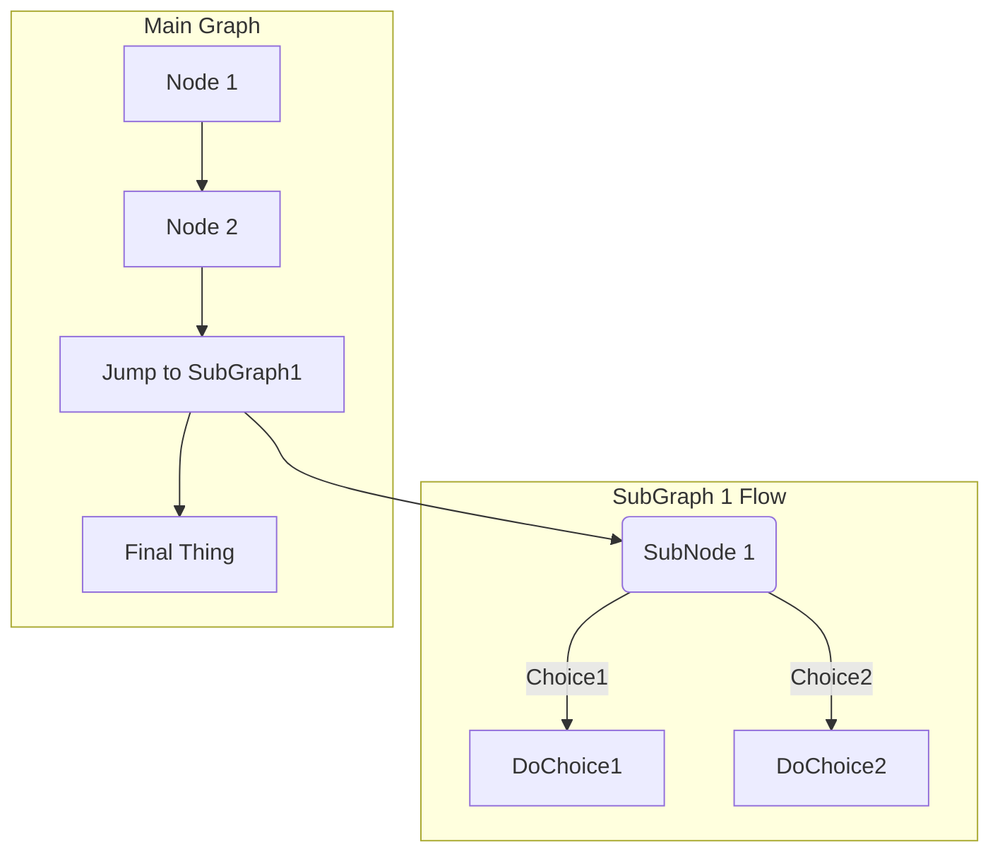
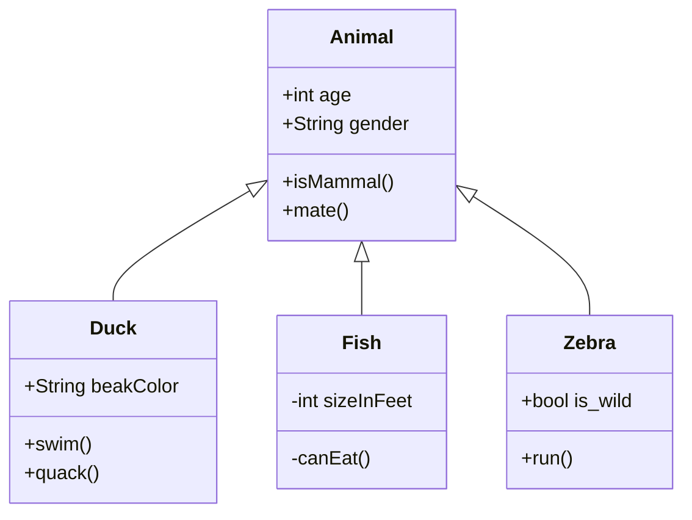

# Xlsx2MySql

## Project Set Up

```bash
ofenloch@teben:~/workspaces/java/poi$ mvn archetype:generate -DgroupId=de.ofenloch.xlsx2mysql -DartifactId=xlsx2mysql -DarchetypeArtifactId=maven-archetype-quickstart
WARNING: An illegal reflective access operation has occurred
WARNING: Illegal reflective access by com.google.inject.internal.cglib.core.$ReflectUtils$1 (file:/usr/share/maven/lib/guice.jar) to method java.lang.ClassLoader.defineClass(java.lang.String,byte[],int,int,java.security.ProtectionDomain)
WARNING: Please consider reporting this to the maintainers of com.google.inject.internal.cglib.core.$ReflectUtils$1
WARNING: Use --illegal-access=warn to enable warnings of further illegal reflective access operations
WARNING: All illegal access operations will be denied in a future release
[INFO] Scanning for projects...
[INFO] 
[INFO] ------------------< org.apache.maven:standalone-pom >-------------------
[INFO] Building Maven Stub Project (No POM) 1
[INFO] --------------------------------[ pom ]---------------------------------
[INFO] 
[INFO] >>> maven-archetype-plugin:3.1.2:generate (default-cli) > generate-sources @ standalone-pom >>>
[INFO] 
[INFO] <<< maven-archetype-plugin:3.1.2:generate (default-cli) < generate-sources @ standalone-pom <<<
[INFO] 
[INFO] 
[INFO] --- maven-archetype-plugin:3.1.2:generate (default-cli) @ standalone-pom ---
[INFO] Generating project in Interactive mode
[INFO] Using property: groupId = de.ofenloch.xlsx2mysql
[INFO] Using property: artifactId = xlsx2mysql
Define value for property 'version' 1.0-SNAPSHOT: : 
[INFO] Using property: package = de.ofenloch.xlsx2mysql
Confirm properties configuration:
groupId: de.ofenloch.xlsx2mysql
artifactId: xlsx2mysql
version: 1.0-SNAPSHOT
package: de.ofenloch.xlsx2mysql
 Y: : 
[INFO] ----------------------------------------------------------------------------
[INFO] Using following parameters for creating project from Old (1.x) Archetype: maven-archetype-quickstart:1.0
[INFO] ----------------------------------------------------------------------------
[INFO] Parameter: basedir, Value: /data/sdb1/home/ofenloch/workspaces/java/poi
[INFO] Parameter: package, Value: de.ofenloch.xlsx2mysql
[INFO] Parameter: groupId, Value: de.ofenloch.xlsx2mysql
[INFO] Parameter: artifactId, Value: xlsx2mysql
[INFO] Parameter: packageName, Value: de.ofenloch.xlsx2mysql
[INFO] Parameter: version, Value: 1.0-SNAPSHOT
[INFO] project created from Old (1.x) Archetype in dir: /data/sdb1/home/ofenloch/workspaces/java/poi/xlsx2mysql
[INFO] ------------------------------------------------------------------------
[INFO] BUILD SUCCESS
[INFO] ------------------------------------------------------------------------
[INFO] Total time:  5.759 s
[INFO] Finished at: 2020-01-08T20:39:07+01:00
[INFO] ------------------------------------------------------------------------
ofenloch@teben:~/workspaces/java/poi$ cd xlsx2mysql/
ofenloch@teben:~/workspaces/java/poi/xlsx2mysql$ git init
Initialized empty Git repository in /data/sdb1/home/ofenloch/workspaces/java/poi/xlsx2mysql/.git/
ofenloch@teben:~/workspaces/java/poi/xlsx2mysql$ git add .
ofenloch@teben:~/workspaces/java/poi/xlsx2mysql$ git commit -a -m"initial check in"
[master (root-commit) eecb8bf] initial check in
 3 files changed, 69 insertions(+)
 create mode 100644 pom.xml
 create mode 100644 src/main/java/de/ofenloch/xlsx2mysql/App.java
 create mode 100644 src/test/java/de/ofenloch/xlsx2mysql/AppTest.java
ofenloch@teben:~/workspaces/java/poi/xlsx2mysql$ git remote add origin https://github.com/ofenloch/xlsx2mysql.git
ofenloch@teben:~/workspaces/java/poi/xlsx2mysql$ git push -u origin master
Enumerating objects: 16, done.
Counting objects: 100% (16/16), done.
Delta compression using up to 8 threads
Compressing objects: 100% (6/6), done.
Writing objects: 100% (16/16), 1.47 KiB | 301.00 KiB/s, done.
Total 16 (delta 0), reused 0 (delta 0)
To https://github.com/ofenloch/xlsx2mysql.git
 * [new branch]      master -> master
Branch 'master' set up to track remote branch 'master' from 'origin'.
ofenloch@teben:~/workspaces/java/poi/xlsx2mysql$ 
ofenloch@teben:~/workspaces/java/poi/xlsx2mysql$ 
ofenloch@teben:~/workspaces/java/poi/xlsx2mysql$ 
ofenloch@teben:~/workspaces/java/poi/xlsx2mysql$ 
ofenloch@teben:~/workspaces/java/poi/xlsx2mysql$ 
ofenloch@teben:~/workspaces/java/poi/xlsx2mysql$ 
ofenloch@teben:~/workspaces/java/poi/xlsx2mysql$ code .
ofenloch@teben:~/workspaces/java/poi/xlsx2mysql$
```

## Building the Project

Use `mvn clean` in the project's root directory to clean everything. Call `mvn compile` to build the class files. To build the
jar file use `mvn package`. You can everything in one single step (e.g. before deploying) with `mvn clean dependency:copy-dependencies package`.

The `dependency:copy-dependencies` copies all required jar files to run your application into the folder *target/dependency/*.

## Running the App

See the bash script *data/runApp.sh* for an example on how to run your program,

## Deploying your Project

Call `mvn clean dependency:copy-dependencies package` to rebuild everything and collect the jar files yout ap needs.


## Diagrams (Off Topic)

If you have installed a mermaid plugin, you can use cool [mermaid graphs](https://mermaidjs.github.io/) in your markdown files.

See <https://docs.gitlab.com/ee/user/markdown.html> for details.

This should show a simple graph:


And this should show a graph with a subgraph:


For a class diagram use something like this


